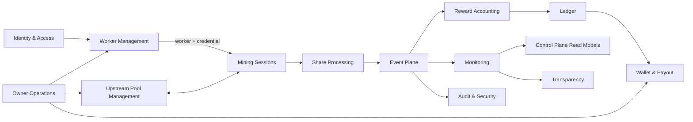

# Context Map

Owner: Abia Nugrahanto  
Status: Accepted baseline

## Relationship rules

- Worker Management adalah upstream context untuk identitas worker.
- Mining Sessions hanya menerima snapshot identitas dan credential result, bukan password plaintext.
- Share Processing adalah upstream context untuk monitoring dan accounting.
- Reward Accounting adalah upstream context untuk Ledger.
- Ledger adalah upstream context untuk payout eligibility.
- Event Plane memakai published language berupa versioned domain events.
- Synchronous dependency dibatasi pada operasi yang membutuhkan jawaban segera, seperti worker authentication dan upstream share response.
