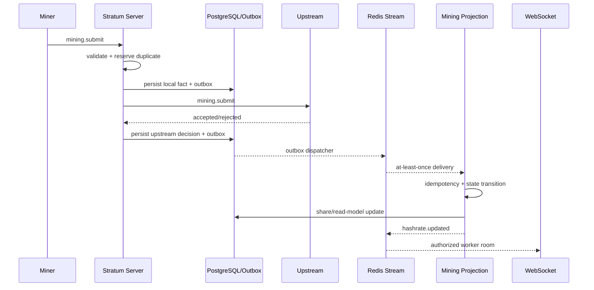

# Event Flow

Owner: Abia Nugrahanto  
Status: Accepted baseline

## Failure behavior

- Redis unavailable: outbox remains pending.
- Consumer crash before ACK: message enters pending list and is reclaimed.
- Duplicate event: idempotency returns completed result.
- Unsupported version: event is rejected and eventually dead-lettered.
- Upstream disconnect: affected jobs are invalidated; transparent recovery remains alpha.6 work.
