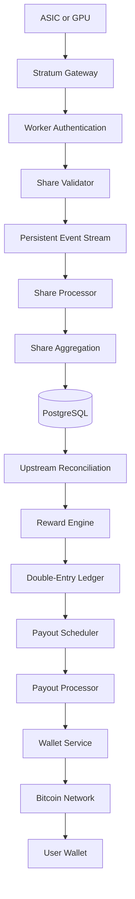

# Mining Flow

```mermaid
flowchart TD
  A[ASIC or GPU] --> B[Stratum Gateway]
  B --> C[Worker Authentication]
  C --> D[Share Validator]
  D --> E[Persistent Event Stream]
  E --> F[Share Processor]
  F --> G[Share Aggregation]
  G --> H[(PostgreSQL)]
  H --> I[Upstream Reconciliation]
  I --> J[Reward Engine]
  J --> K[Double-Entry Ledger]
  K --> L[Payout Scheduler]
  L --> M[Payout Processor]
  M --> N[Wallet Service]
  N --> O[Bitcoin Network]
  O --> P[User Wallet]
```
