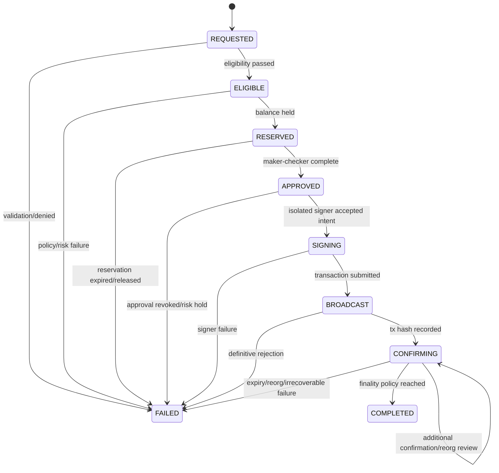
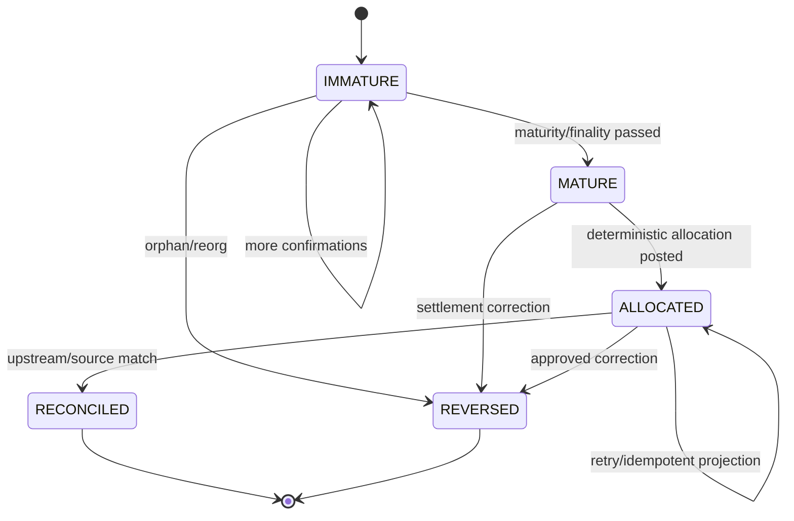
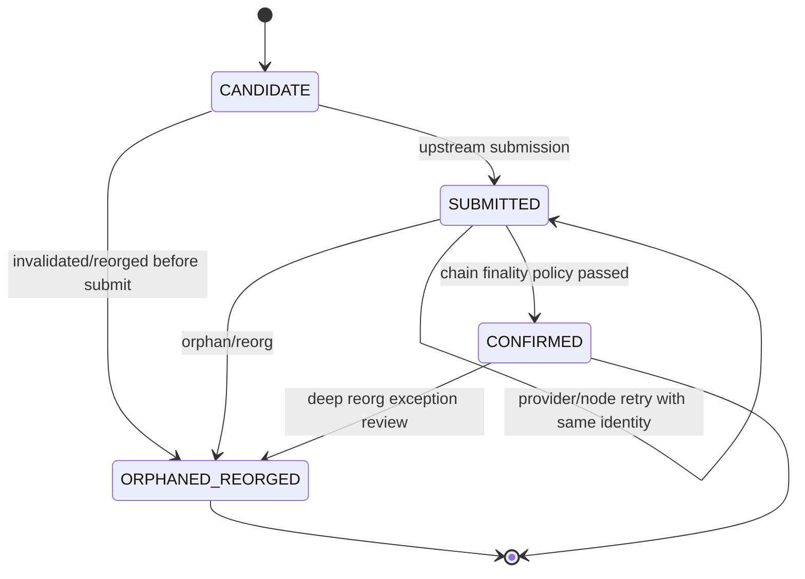

# Financial State Machines

- **Status:** Documentation-only specification
- **Branch:** `feat/state-machine-specification`
- **Scope:** Payout, reward, dan block lifecycle
- **Baseline:** `main` pada commit `770e38c5e119102635aefa97893cdcbdbc345da9`
- **Out of scope:** Implementasi backend, Prisma schema, migration, RandomX, `upstream-stratum`, dan perubahan ledger code

> Setiap state transition wajib **idempotent, auditable, monotonic terhadap lifecycle yang sah, dan dapat direkonsiliasi**. Retry tidak boleh membuat duplicate allocation, reservation, payout, atau reversal.

## 1. State-machine invariants

1. Setiap entity memiliki immutable ID, `state`, `version`, `createdAt`, `updatedAt`, `correlationId`, dan `lastTransitionId`.
2. Transition menerima command ID/idempotency key dan menghasilkan transition/audit event yang dapat dicari ulang.
3. Replaying command yang sama dengan payload yang sama mengembalikan outcome yang sama; payload berbeda pada command ID yang sama menghasilkan conflict.
4. Transition yang tidak tercantum pada tabel resmi ditolak; database tidak boleh menjadi tempat untuk mem-bypass state machine.
5. State terminal tidak dapat mundur kecuali transition koreksi yang dinyatakan eksplisit, diaudit, dan memiliki reason/reference.
6. External provider timeout menghasilkan state yang dapat direkonsiliasi, bukan asumsi sukses atau gagal.
7. Financial side effect menggunakan atomic transaction/outbox; projection boleh terlambat tetapi dapat dibangun ulang.
8. Setiap transition menyimpan actor/system, reason, policy version, previous state, next state, request ID, correlation ID, dan audit ID.
9. Sensitive transitions tunduk pada permission, step-up, maker-checker, risk gate, dan emergency pause.
10. User-facing API menampilkan state dan `nextAction`; UI tidak boleh menebak state dari HTTP status atau toggle lokal.

## 2. Payout state machine

### 2.1 State diagram



### 2.2 Official states and guards

| State        | Meaning                                                                             | Entry guard                                                           | Allowed next states                               |
| ------------ | ----------------------------------------------------------------------------------- | --------------------------------------------------------------------- | ------------------------------------------------- |
| `REQUESTED`  | User intent diterima tetapi belum eligible                                          | Auth, asset/network, destination, amount, and idempotency validated   | `ELIGIBLE`, `FAILED`                              |
| `ELIGIBLE`   | Balance settled/reconciled, threshold, maturity, route, risk, and hold checks lulus | Immutable eligibility snapshot                                        | `RESERVED`, `FAILED`                              |
| `RESERVED`   | Spendable balance ditahan secara atomic                                             | Reservation journal/record and expiry created                         | `APPROVED`, `FAILED`                              |
| `APPROVED`   | Maker-checker and policy approval selesai                                           | Approver berbeda dari requester sesuai policy                         | `SIGNING`, `FAILED`                               |
| `SIGNING`    | Signer terisolasi menerima intent terverifikasi                                     | Intent hash, destination fingerprint, amount, policy, and limit match | `BROADCAST`, `FAILED`                             |
| `BROADCAST`  | Transaction submission menghasilkan tx reference/hash                               | Node/provider accepts broadcast or returns unambiguous tx ID          | `CONFIRMING`, `FAILED`                            |
| `CONFIRMING` | Transaction dipantau sampai finality                                                | Node quorum and confirmation policy active                            | `CONFIRMING`, `COMPLETED`, `FAILED`               |
| `COMPLETED`  | Final confirmation/reconciliation selesai                                           | Tx, ledger, wallet/node, and payout record match                      | Terminal                                          |
| `FAILED`     | Terminal failure atau controlled release                                            | Safe failure reason and recovery action recorded                      | Terminal atau explicit `RETRY_REQUESTED` workflow |

### 2.3 Payout transition requirements

- `REQUESTED → ELIGIBLE` tidak boleh mengubah balance.
- `ELIGIBLE → RESERVED` harus atomic dan idempotent; concurrent request hanya boleh menghasilkan satu reservation aktif.
- `RESERVED → APPROVED` wajib menyimpan approver, decision, reason, limit policy, dan timestamp.
- `APPROVED → SIGNING` harus memverifikasi ulang destination fingerprint, amount, asset/network, policy version, dan reservation.
- `SIGNING → BROADCAST` tidak boleh mengekspos private key ke API, database aplikasi, browser, atau log.
- `BROADCAST → CONFIRMING` harus menyimpan tx hash/provider reference; timeout ambigu masuk reconciliation, bukan blind retry.
- `CONFIRMING → COMPLETED` memerlukan confirmation/finality policy dan node/provider agreement.
- Reorg atau mismatch dapat menahan `CONFIRMING`, tetapi tidak boleh menghapus histori transition.
- `FAILED` harus membawa `failureCode`, `retryable`, `recoveryAction`, dan reference ke incident/reconciliation bila relevan.

### 2.4 Payout idempotency and audit

Command key minimal di-scope oleh principal, endpoint, payout/account, dan operation. TTL payout disarankan ≥24 jam atau sampai terminal reconciliation. Audit events minimum:

`PAYOUT_REQUESTED`, `PAYOUT_ELIGIBILITY_EVALUATED`, `PAYOUT_RESERVED`, `PAYOUT_APPROVED`, `PAYOUT_SIGNING_STARTED`, `PAYOUT_BROADCAST`, `PAYOUT_CONFIRMATION_UPDATED`, `PAYOUT_COMPLETED`, `PAYOUT_FAILED`, `PAYOUT_PAUSED`, dan `PAYOUT_RELEASED`.

Tidak boleh ada event transition tanpa `previousState`, `nextState`, `transitionId`, `idempotencyKeyHash`, `requestId`, `correlationId`, actor/system, policy version, dan safe resource references.

## 3. Reward state machine

### 3.1 State diagram



### 3.2 Official states and rules

| State        | Meaning                                                                    | Required evidence                                                    | Allowed next states                   |
| ------------ | -------------------------------------------------------------------------- | -------------------------------------------------------------------- | ------------------------------------- |
| `IMMATURE`   | Reward source exists tetapi belum melewati maturity/finality               | Block/settlement reference, confirmation count, asset/network policy | `IMMATURE`, `MATURE`, `REVERSED`      |
| `MATURE`     | Reward source final menurut policy                                         | Maturity evidence and policy version                                 | `ALLOCATED`, `REVERSED`               |
| `ALLOCATED`  | Gross/net/fee/referral allocation dihitung dan journal entry dibuat        | Deterministic inputs, fee snapshot, balanced journal                 | `ALLOCATED`, `RECONCILED`, `REVERSED` |
| `RECONCILED` | Source upstream/provider, internal liability, ledger, and allocation cocok | Source checksum, reconciliation report, exception cleared            | Terminal                              |
| `REVERSED`   | Koreksi equal-and-opposite telah diposting                                 | Original reference, reason, approver, reversal journal               | Terminal                              |

Reward tidak boleh berpindah langsung dari `IMMATURE` ke spendable balance. `MATURE` juga belum berarti payout eligible; threshold, route, hold, risk, dan payout gate tetap diperiksa terpisah.

### 3.3 Reward transition requirements

- Maturity policy bersifat asset/network/reward-scheme-specific dan terversi.
- Orphan atau reorg menghasilkan transition/event baru dan dapat memicu reversal; original reward fact tetap immutable.
- `MATURE → ALLOCATED` menghitung platform fee standard 0,50%, referral miner fee 0,375%, beneficiary 0,125%, serta MP05 donation liability bila attribution valid.
- Allocation harus deterministik terhadap source snapshot, rounding mode, asset decimals, fee policy, referral policy, dan settlement period.
- `ALLOCATED → RECONCILED` memerlukan source checksum, period match, balanced journal, dan exception-free result.
- Correction tidak boleh mengedit/delete allocation posted; gunakan reversal/adjustment dengan reason dan approval.

## 4. Block state machine

### 4.1 State diagram



### 4.2 Official states and rules

| State              | Meaning                                                                 | Required evidence                                             | Allowed next states                                       |
| ------------------ | ----------------------------------------------------------------------- | ------------------------------------------------------------- | --------------------------------------------------------- |
| `CANDIDATE`        | Block candidate/claim terdeteksi tetapi belum ada submission/finality   | Template, job, share/nonce, worker/session, correlation ID    | `SUBMITTED`, `ORPHANED_REORGED`                           |
| `SUBMITTED`        | Candidate diteruskan ke upstream/node dan memiliki submission reference | Provider response, tx/block reference, timestamp              | `SUBMITTED`, `CONFIRMED`, `ORPHANED_REORGED`              |
| `CONFIRMED`        | Block melewati confirmation/maturity policy                             | Block hash/height, chain tip, confirmation count, node quorum | Terminal atau exceptional reorg review                    |
| `ORPHANED_REORGED` | Candidate/block invalidated, orphaned, atau terkena reorg               | Old/new chain data, reason, affected reward period            | Terminal; recovery melalui reward/reconciliation workflow |

Block confirmation tidak boleh menghapus share, job, atau candidate fact. Block-level state dan reward-level state harus dapat ditelusuri melalui correlation ID.

## 5. Cross-cutting transition contract

### Command envelope

```json
{
  "commandId": "cmd-uuid",
  "idempotencyKey": "idem-uuid",
  "entityId": "payout-uuid",
  "expectedVersion": 4,
  "requestedAt": "2026-08-27T08:00:00Z",
  "actor": {
    "type": "USER",
    "id": "user-uuid"
  },
  "reason": "manual_payout_request",
  "correlationId": "corr-uuid",
  "requestId": "req-uuid"
}
```

### Transition result

```json
{
  "entityId": "payout-uuid",
  "previousState": "ELIGIBLE",
  "nextState": "RESERVED",
  "version": 5,
  "transitionId": "transition-uuid",
  "auditId": "audit-uuid",
  "correlationId": "corr-uuid",
  "idempotentReplay": false,
  "nextAction": "MANUAL_APPROVAL"
}
```

### Conflict and retry behavior

| Situation                                  | Required result                                                                                      |
| ------------------------------------------ | ---------------------------------------------------------------------------------------------------- |
| Same command/idempotency key, same payload | Return original transition result with `idempotentReplay=true`                                       |
| Same key, different payload                | `409 IDEMPOTENCY_CONFLICT`; no state change                                                          |
| Expected version stale                     | `412 VERSION_MISMATCH`; no state change                                                              |
| Transition not allowed                     | `409 INVALID_STATE_TRANSITION`; no side effect                                                       |
| External timeout with unknown outcome      | Keep recoverable pending state and run reconciliation; no blind duplicate                            |
| Duplicate event delivery                   | Consumer acknowledges idempotently; no duplicate journal/reservation                                 |
| Event arrives out of order                 | Store/defer/reject according to version and causal ordering; never regress silently                  |
| Operator emergency pause                   | New sensitive commands denied with `PAYOUT_PAUSED` or domain-specific code; existing state preserved |

## 6. Acceptance criteria

- [ ] Payout, reward, dan block state enum disetujui owner/product/security/finance yang relevan.
- [ ] Semua allowed transition memiliki guard, actor, policy, side effect, failure state, dan audit event.
- [ ] Semua mutation memiliki idempotency key dan replay test.
- [ ] Semua sensitive mutation memiliki optimistic concurrency atau equivalent version guard.
- [ ] Retry setelah timeout tidak menghasilkan duplicate payout, allocation, reservation, atau journal.
- [ ] Orphan/reorg dapat diproses tanpa mengedit atau menghapus fakta historis.
- [ ] Projection/dashboard dapat dibangun ulang dari durable events.
- [ ] API mengembalikan previous/next state, version, transition ID, audit ID, correlation ID, dan next action.
- [ ] State terminal dan exception memiliki runbook, alert, dan owner.
- [ ] Test evidence mencakup normal path, invalid transition, concurrent command, duplicate delivery, provider timeout, restart/recovery, reorg, dan reconciliation mismatch.
- [ ] Dokumentasi API dan frontend menggunakan enum serta status copy yang sama.

Implementasi backend yang mengikuti dokumen ini harus dibuat pada branch/PR terpisah dan tidak boleh menyentuh RandomX, migration, atau frozen Codex areas tanpa koordinasi eksplisit.
